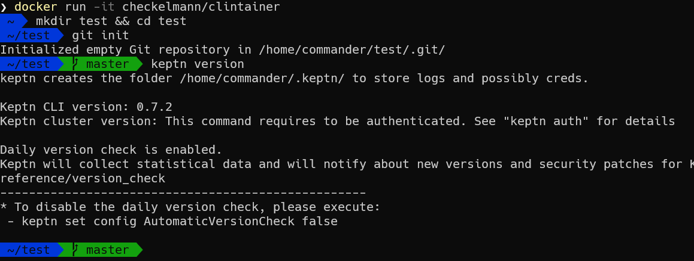

# clintainer

[](https://travis-ci.com/checkelmann/clintainer)

Docker Container loaded with a lot of K8s CLI's like kubectl, helm, istio and keptn preloaded with Oh My ZSH.

This image will be automatically build every week and is using the latest available releases of the tools.

If you need to work on a remote server and don't want to install all the tools manually, or for ad-hoc operation tasks.



## Run clintainer

```
docker run -v ~/.kube/config:/home/operator/.kube/config -it checkelmann/clintainer
```
## Cleanup
```
docker rmi checkelmann/clintainer
```

## Included tools:

- Git
- Git LFS
- Bit (github.com/chriswalz/bit)
- Oh My Zsh (github.com/ohmyzsh/ohmyzsh)
- kubectl 
- keptn (github.com/keptn)
- helm3 (helm.sh)
- istioctl (istio.io)
- OpenServiceMesh (github.com/openservicemesh)
- eksctl
- k9s (github.com/derailed/k9s)
- kubectx & kubens (github.com/ahmetb/kubectx)

__If you want more, just open an issue or feel free to contribute!__